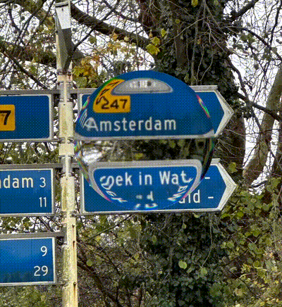
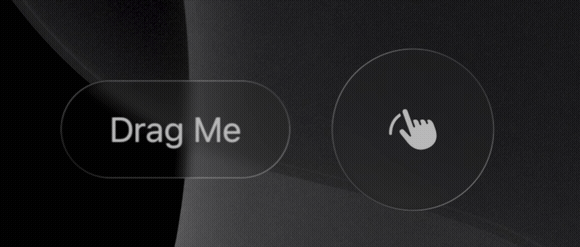

# OpenGlass

Apple's Liquid Glass, on any iOS version

<p align="center">
    
    
</p>

Every visual detail matched against Apple's native implementation. The optical behavior, the lighting, the way glass adapts to what's behind it. Ships with Apple's exact tuning out of the box. Every parameter is exposed and configurable

<p align="center">
    
    
</p>

## Installation

```swift
dependencies: [
    .package(url: "https://github.com/mi11ione/OpenGlass", from: "2.0.0")
]
```

```swift
import OpenGlass
```

## Quick Start

```swift
Text("Hello, Glass")
    .padding()
    .openGlassEffect()
```

The API mirrors Apple's. `.glassEffect()` becomes `.openGlassEffect()`. If you know the native API, you already know OpenGlass

## Styles

```swift
Text("Regular").openGlassEffect(.regular)  // standard glass
Text("Clear").openGlassEffect(.clear)      // transparent, minimal blur
Text("Identity").openGlassEffect(.identity) // no effect, animate in/out
```

## Shapes

```swift
Text("Circle").openGlassEffect(in: Circle())
Text("Rounded").openGlassEffect(in: RoundedRectangle(cornerRadius: 16))
Text("Sharp").openGlassEffect(in: Rectangle())
Text("Custom").openGlassEffect(cornerRadius: 24)
```

Default is capsule

## Physics

Spring-based touch interactions. Press scales on touch. Anchored stretches toward your finger but stays in place. Free moves with velocity-based squash-stretch and rotation

```swift
Text("Press").openGlassEffect(.regular.press())
Text("Anchored").openGlassEffect(.regular.anchored())
Text("Free").openGlassEffect(.regular.free())
```

## Buttons

```swift
Button("Glass") { }
    .buttonStyle(.openGlass)

Button("Clear") { }
    .buttonStyle(.openGlass(.clear))
```

## Configuration

For full control, pass a `GlassConfiguration` directly:

```swift
var config = GlassConfiguration()
config.refractionStrength = 0.6
config.chromeStrength = 4.5
config.blurRadius = 0.0
config.glassTintStrength = 0.0
config.zoom = 1.06
config.physicsMode = .anchored

Text("Custom").openGlassEffect(configuration: config)
```

All physics parameters are configurable too: velocity sensitivity, stretch limits, spring stiffness, damping, rotation, pressed-state scale and opacity

## UIKit

```swift
let glassView = OpenGlassView(configuration: .regular)
glassView.frame = CGRect(x: 100, y: 200, width: 200, height: 50)
parentView.addSubview(glassView)
```

## Under the Hood

A custom layer-tree compositor built in Metal and Obj-C++. Instead of screenshotting the view hierarchy, OpenGlass traverses the CALayer tree, reconstructs the scene on the GPU, and renders glass on top

The traversal handles transforms, masks, clipping, gradients, content gravity, z-ordering, presentation layers mid-animation. The compositor batches everything into Metal draw calls with texture atlasing, gradient LUT caching, and mask stack management

Each glass element gets GPU-computed background luminance with hysteresis-based regime switching. Glass adapts its tinting to light and dark backgrounds in real time. Text color follows automatically

Handles dozens of glass elements without dropping a frame

## Known Limitations

- When dynamically changing a glass element's size without changing its SwiftUI view identity (e.g., same view with different `.frame()` values), the glass may not resize. Add `.id()` to force a fresh instance when the size changes
- `TimelineView` or `CAGradientLayer` with continuous animations may cause frame rate drops when used as content behind glass elements
- Rapidly switching tabs containing glass elements may cause temporary frame rate drops. Performance returns to normal once navigation settles

## Demo

See [OpenGlassDemo](https://github.com/mi11ione/OpenGlassDemo) for a standalone demo app with every feature and parameter tweakable in real time

## Roadmap

- MacOS support
- Color tinting with blend modes (multiply, overlay, screen, color dodge, soft light)
- GlassEffectContainer
- Prominent button style

## License

MIT. See [LICENSE](LICENSE) for details
